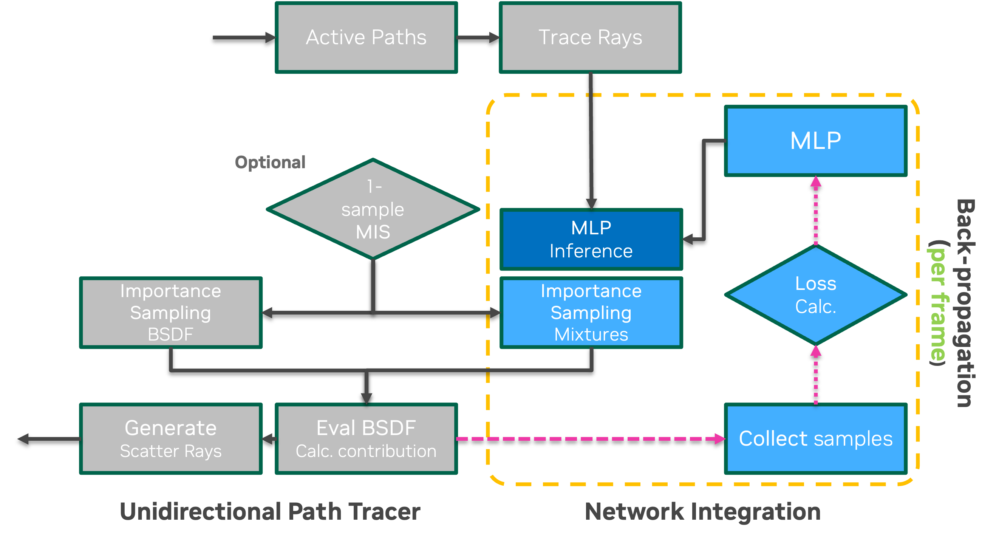

# Neural Mixture Guiding 

This is our GPU prototype implementation of the work *Neural Parametric Mixtures for Path Guiding*. This work presents an lightweight alternative for neural path guding that is practical for GPU parallel rendering, not as expressive as implicit models (e.g., normalizing flow) but faster. In this version of code, we integrated our algorithm into a wavefront path tracer using OptiX and implemented networks with *tiny-cuda-nn*, while manually implementing the derivative computation routines. We also refer interested readers to a concurrent work [Online Neural Path Guiding with Normalized Anisotropic Spherical Gaussians](https://dl.acm.org/doi/10.1145/3649310) which contains a similar idea and comprehensive experiments.

Sorry for this late, late release. I tried to make this codebase more stable&robust but have not been very successful, and may not have the time anymore. The main purpose of this code is to provide information about the actual implementation and scene/parameter setup. *Writing experiments or protoyping on this codebase is possibly unrecommended as it is not stable or bug-free...*  

### Building and Run

#### Requirements

- Nvidia RTX GPU (with HWRT support).
- OptiX **7.3+** and CUDA **11.4+** (but not all of them might work).
- Vulkan SDK (**1.3+**).  
- Newer versions of **MSVC** (**Windows only**).

#### Building

This project uses CMake to build, no additional setting is needed. Make sure cuda is installed and added to PATH. While it tries to guess the OptiX installation path (i.e., the default installation directory on Windows), you may specify the `OptiX_INSTALL_DIR` environment variable manually in case it failed.

#### See the implementation in 1 min

#### Interactive Rendering Mode (unstable)

There is an interactive rendering mode where you can explore the scene by moving the camera with path guiding enabled. Use the interactive config to play with it: `common/configs/render/interactive.json`. Use LShift, LMButton, and scroll to control the orbit camera. Guiding is disabled by default in this mode, check the "Enable Training" box in the GUI -> GuidedPathTracer to enable guiding (and uncheck to disable it). You can also directly run `testbed.exe` without any arguments to enter this default configuration once the project is built.

#### Offline Rendering Mode 

To run an offline rendering task, two configuration file need to be provided via command line arguments: the scene configuration and the method configuration. We have provided some configurations (.json files) for equal-sample experiments in this code. Example: 

~~~bash
build/src/testbed.exe -scene common/configs/scenes/veach-ajar.json -method common/configs/render/guided.json
~~~

##### Scene configuration

Containing the path to 3D scene file, camera configurations, etc. Specify this with `-scene`. We bundled some example scenes in `common/configs/scenes/`, including Veach-Ajar, Bathroom, and Veach-Egg. 

##### Method configuration  

Containing the rendering method, and its parameters. Specify this with `-method`. Example: `common/configs/render/guided.json` and  `common/configs/render/pt_bsdf.json`. (The *guided* refers to NPM learning the full distribution, i.e., $L_i \times f_{\mathrm{s}}  \cos$).

##### Run experiments with python script

If the pybind11 python binding is built successfully, the renderer could be called from the scripts. See the sample script at `scripts/run.py`or  `scripts/run_experiments.py`. Running with python script also comes with a built-in error calculator.

##### Notes

The rendering code has some changes after the experiments, but the error metrics should still be similar, hopefully if nothing goes wrong. However,

- The metric might have small perturbations from run to run as the parallel training sample collection & gradient reduction process is non-deterministic.
- We even have observed a different training convergence and error due to switching CUDA versions. A recent test is on *CUDA 11.8* and seems OK. Example relative MSE result: 0.62(PT) and ~0.038(Guided) on Veach-Ajar (750SPP) in our environment. 

### Issues

**Missing Features**: the ***pixel sample weighting*** scheme (e.g., inverse-variance weighting) and ***learnable selection probability*** are not implemented in this version.  *In experiments and comparisons we disabled these features for all the methods.* An option is also provided to enable a simple pixel weighting scheme (`sample_weighting`, disabled by default) to scale down the weight of earlier samples, similar to that suggested by *Huang et al.* This could provide significant performance boost sometimes (e.g., relMSE from ~0.038 to ~0.030 in Veach-Ajar).

**Training Sample Collection**: in this implementation we used a workaround that limits the maximum depth for collecting samples to fit the sample count for the target batch size. In practice it is better to use an adaptive strategy, like auto-adjusting the training pixel strides.

**Training Stability**: See the code for numerical stability considerations in the manual derivative computation.  We did not implement any gradient clipping schemes in this version while it's better to do so in practice, and we have observed some rare training crashes possibly due to this.
